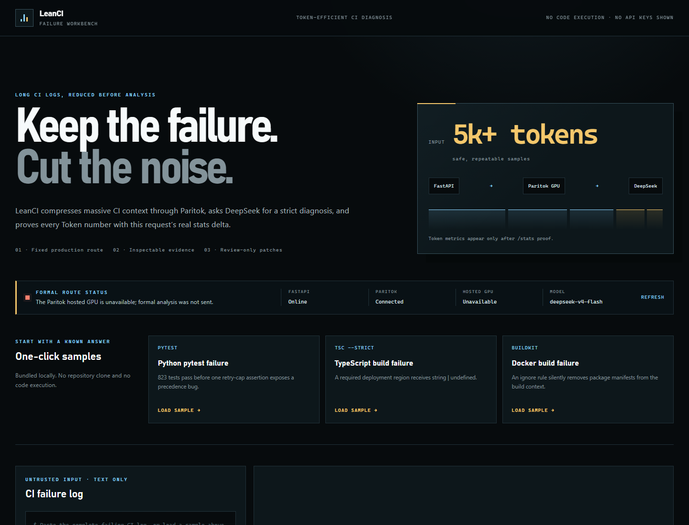
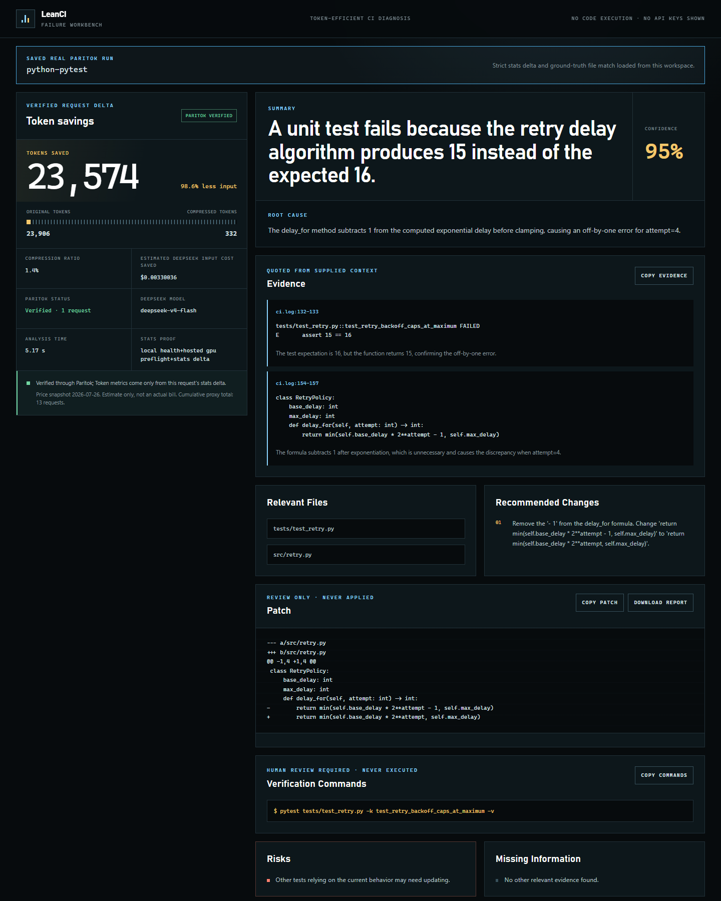
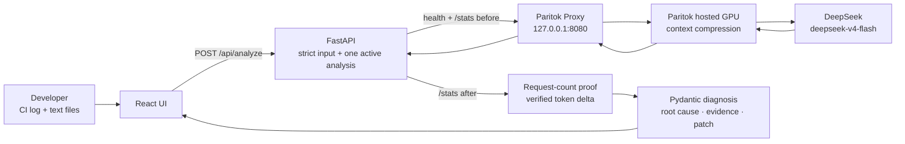

# LeanCI

**Token-efficient AI debugging for massive CI logs**

[](https://github.com/Paritok-official/paritok-4b-v1)
[](https://api-docs.deepseek.com/)
[](LICENSE)

Built with [Paritok](https://github.com/Paritok-official/paritok-4b-v1) and
[DeepSeek](https://api-docs.deepseek.com/).

LeanCI turns large CI logs and a small set of related text files into a structured
failure diagnosis: summary, root cause, evidence, relevant files, recommended
changes, a proposed patch, verification commands, risks, and missing information.

The formal request path is:

```text
FastAPI -> local Paritok proxy -> Paritok hosted GPU -> DeepSeek API
```

Paritok does real work in the running product. LeanCI measures each request with
before/after Paritok `/stats` snapshots and verifies the proxy request count. If the
proxy, hosted GPU, or token proof is unavailable, the formal endpoint fails closed.
It does not fall back to a direct model call or display estimated token counts.

## Product screenshots

| CI analysis workspace | Python root cause and token proof |
| --- | --- |
| [](artifacts/screenshots/home.png) | [](artifacts/screenshots/python-pytest-result.png) |
| [TypeScript build diagnosis](artifacts/screenshots/typescript-build-result.png) | [Docker build diagnosis](artifacts/screenshots/docker-build-result.png) |

[Mobile layout at 500 px](artifacts/screenshots/mobile-layout-500.png)

## What LeanCI provides

- Five long, deterministic CI failure samples with ground truth.
- Strict server-side input, path, UTF-8, extension, file-count, and size controls.
- A fixed Paritok hosted-GPU route with health and request-scoped token proof.
- Strict DeepSeek JSON output validated by Pydantic.
- At most one JSON-repair request; no unbounded retry.
- Root cause, evidence, files, patch, verification commands, risks, and confidence.
- Copy and sanitized Markdown report export.
- A frozen baseline-versus-Paritok benchmark with every failed or skipped row.
- A single non-root Docker image for React, FastAPI, and loopback-only Paritok.
- No repository cloning, user URL fetching, shell execution, or automatic patching.

## Quick start

### Requirements

- Git
- Python 3.11 or newer
- Node.js 20.19, 22.12, or a compatible newer version
- A Paritok API key
- A DeepSeek API key with available balance
- Windows PowerShell for the commands below

Docker users need Docker Desktop instead of a local Python and Node runtime.

### Install from a clean clone

```powershell
git clone https://github.com/Gxinxin-sudo/LeanCI.git
Set-Location LeanCI

python -m venv backend\.venv
.\backend\.venv\Scripts\python.exe -m pip install --upgrade pip
.\backend\.venv\Scripts\python.exe -m pip install --requirement backend\requirements-dev.txt

Push-Location frontend
npm ci
Pop-Location
```

Create a local `.env` without overwriting an existing one:

```powershell
if (-not (Test-Path -LiteralPath ".env")) {
    Copy-Item ".env.example" ".env"
}
```

Fill only the two secret values in the ignored `.env`:

```dotenv
PARITOK_API_KEY=
DEEPSEEK_API_KEY=
LLM_PROVIDER=paritok
DEEPSEEK_MODEL=deepseek-v4-flash
PRICING_SNAPSHOT_DATE=2026-07-31
```

Never paste credentials into source code, terminal output, chat, tests, logs,
screenshots, `paritok.yaml`, or Git.

### Run locally

Open three PowerShell terminals at the repository root.

Terminal 1 — Paritok:

```powershell
.\scripts\start_paritok.ps1
```

Terminal 2 — FastAPI:

```powershell
.\backend\.venv\Scripts\python.exe -m uvicorn app.main:app `
  --app-dir backend `
  --host 127.0.0.1 `
  --port 8000 `
  --workers 1
```

Terminal 3 — React:

```powershell
Set-Location frontend
npm run dev
```

Open `http://127.0.0.1:5173`.

Before an analysis, confirm that FastAPI, the local proxy, and the hosted GPU are
healthy. Load a fixed sample, select **Analyze failure**, and review the verified
token metrics and structured diagnosis. Patches and commands are text only.

### Run with Docker

```powershell
docker build --progress=plain --tag leanci:latest .
docker compose up --detach
Invoke-RestMethod "http://127.0.0.1:8000/api/health"
```

The image exposes FastAPI only. Paritok remains inside the container on
`127.0.0.1:8080`. See [Docker verification](docs/DOCKER.md).

## Architecture



Key guarantees:

- `/api/analyze` cannot override provider, model, URL, or execution mode.
- Local proxy health alone is not enough; LeanCI also checks the hosted GPU.
- A single worker and process-local lock isolate the `/stats` attribution window.
- An inconsistent, missing, or contaminated stats delta invalidates the result.
- Empty or invalid DeepSeek JSON permits one repair through the same Paritok route.
- CI evidence is placed in untrusted tool-result messages; no tool is executed.
- The application never executes logs, patches, paths, URLs, or suggested commands.

See [architecture](docs/ARCHITECTURE.md) for the full state machine and trust
boundaries.

## Deterministic samples

| Sample | Log size | Known root cause | Expected files |
| --- | ---: | --- | --- |
| Python pytest | 69.5 KiB | Backoff operator precedence produces 15 instead of the cap of 16 | `retry.py`, `test_retry.py` |
| TypeScript build | 73.9 KiB | `DEPLOY_REGION` may be `undefined` but is assigned to a required `string` | `config.ts`, `deploy.ts` |
| Docker build | 40.1 KiB | `*.json` in `.dockerignore` removes package manifests from the build context | `Dockerfile`, `.dockerignore` |
| Dependency resolution | 63.6 KiB | React 19 conflicts with a React-18-only peer dependency | `package.json`, `package-lock.json` |
| GitHub Actions environment | 56.2 KiB | An unset repository variable leaves `DEPLOY_ENV` empty | `deploy.yml`, `validate_env.py` |

Each sample contains a long secret-free log, a small set of related text files, and
`ground_truth.json`. Ground truth is used for tests and deterministic scoring only;
it is never sent to the model. See [sample details](examples/README.md).

## Hosted-GPU evidence

Three saved requests were run through the formal route on 2026-07-26. Every token
value below is the request-scoped Paritok `/stats` delta, not a character estimate
or model-generated value:

| Sample | Original | Compressed | Saved | Savings | Analysis time |
| --- | ---: | ---: | ---: | ---: | ---: |
| Python pytest | 23,906 | 332 | 23,574 | 98.61% | 5,168 ms |
| TypeScript build | 20,542 | 847 | 19,695 | 95.88% | 4,674 ms |
| Docker build | 8,325 | 117 | 8,208 | 98.59% | 4,574 ms |

All three used `deepseek-v4-flash`, reported one proxy request, and passed the
expected-file and fix-direction checks. Sanitized results are stored in
`examples/<id>/demo_result.json`.

These values document specific historical requests. They are not a guarantee for
new input or future service behavior.

To refresh one saved result, first verify local health, then explicitly authorize
one paid request:

```powershell
.\backend\.venv\Scripts\python.exe scripts\run_demo_samples.py --confirm-cost --sample python-pytest
```

Without `--confirm-cost`, the command sends no model request.

## Benchmark

The frozen benchmark compares an uncompressed DeepSeek baseline with the Paritok
route for all five samples. Each pair uses the same initial messages, model,
prompts, sample content, `max_tokens=4096`, disabled thinking, and JSON Object
configuration. Matching SHA-256 values prove identical initial messages.

The controlled run on 2026-07-26 made ten model requests with no JSON repair,
network retry, or timeout. All rows are preserved:

- five completed baseline rows;
- two Paritok rows where compression occurred;
- three `skipped_low_yield` rows confirmed as `below_refusal_threshold`;
- no unavailable or upstream-failed rows.

Across the **two compressed rows**, mean token savings were `85.53%`. Across the
five valid quality pairs, deterministic scores changed from `73.00/100` to
`54.00/100`, a difference of `-19.00` points.

The result does **not** support claims that:

- all five cases were compressed;
- five-case mean savings were 85.53%;
- output quality was preserved;
- the deployment is production-ready;
- the USD estimate is an actual bill reduction.

The read-only benchmark UI is available at
`http://127.0.0.1:5173/?view=benchmark`. Full artifacts and methodology are in
[benchmarks](benchmarks/README.md) and [the report](benchmarks/report.md).

## Token and cost semantics

LeanCI calculates token metrics only from one locked before/after window:

```text
original_tokens   = after.input_tokens_original - before.input_tokens_original
compressed_tokens = after.input_tokens_compressed - before.input_tokens_compressed
saved_tokens      = after.tokens_saved - before.tokens_saved
compression_ratio = compressed_tokens / original_tokens
```

The `/stats.total_requests` delta must equal the provider's actual request attempts.
LeanCI never substitutes character counts, DeepSeek usage, or model output.

Paritok's `estimated_cost_saved_usd` is excluded because its price may not match
DeepSeek. LeanCI calculates an input-only estimate:

```text
estimated_input_cost_saved_usd =
  saved_tokens * configured_cache_miss_input_price / 1,000,000
```

The current configuration was checked against
[DeepSeek's official pricing](https://api-docs.deepseek.com/quick_start/pricing/)
on 2026-07-31:

| Price item | USD per 1M tokens |
| --- | ---: |
| Cache-hit input | 0.0028 |
| Cache-miss input | 0.14 |
| Output | 0.28 |

Prices can change. The UI always displays the snapshot date and states that the
amount is an estimate, not an invoice. Frozen artifacts keep their original
run-time snapshot dates.

## Input limits

FastAPI enforces the final boundary:

| Item | Limit |
| --- | ---: |
| Entire HTTP request | 4 MiB, including chunked input |
| CI log | 2 MiB UTF-8 |
| Files | 5 maximum |
| One file | 256 KiB UTF-8 |
| All files | 1 MiB |

The server sanitizes allowed filenames and rejects:

- path separators, drive prefixes, traversal, duplicates, and reserved names;
- archives, executable formats, and unsupported extensions;
- NUL, binary content, invalid UTF-8, and disallowed control characters;
- local filesystem paths and user-provided URLs.

Uploaded content is processed in memory only.

## API

| Method | Path | Behavior |
| --- | --- | --- |
| `GET` | `/api/health` | Checks local proxy and hosted GPU; does not call DeepSeek |
| `GET` | `/api/config-status` | Returns configuration booleans and fixed names, never credentials |
| `GET` | `/api/samples` | Lists fixed samples |
| `GET` | `/api/samples/{id}` | Loads one fixed sample |
| `GET` | `/api/captures/{id}` | Loads a saved sanitized result |
| `GET` | `/api/benchmark/results` | Reads frozen artifacts; makes no model call |
| `POST` | `/api/analyze` | The only formal analysis endpoint |

Example request:

```json
{
  "log_text": "CI failure text",
  "files": [
    {
      "name": "config.ts",
      "content": "export const region = process.env.DEPLOY_REGION"
    }
  ]
}
```

Errors contain a stable code, safe message, and server-generated request ID. They
never include environment values, request headers, credentials, upstream bodies,
stack traces, or internal absolute paths.

## Security and privacy

- Formal analysis always uses Paritok; no automatic Direct or Mock fallback exists.
- Credentials are environment-only and excluded from source, image layers, logs,
  errors, screenshots, and Git.
- Upload validation is repeated on the server.
- Model commands and patches are never executed or automatically applied.
- Access logs contain fixed route labels and omit request bodies and model content.
- Public production analysis requires an authenticated TLS/OIDC gateway, shared
  distributed rate limiting, and a UTC daily request budget.

LeanCI itself does not persist submitted logs or uploaded files. Formal analysis
sends that content through Paritok, DeepSeek, and the hosting path, so their
retention policies still apply. Do not submit credentials, personal data, or
private source code without authorization.

See [security policy](SECURITY.md) and [threat model](docs/THREAT_MODEL.md).

## Known limitations

- There is currently no public live-demo domain. The public repository and these
  setup instructions are the reproducible project URL.
- Paritok may intentionally skip low-yield blocks; three of five frozen benchmark
  cases were `skipped_low_yield`.
- The frozen benchmark shows a 19-point mean quality decrease across five valid
  pairs and does not support a quality-preservation claim.
- `/stats` is cumulative and process-local, so the reference deployment uses one
  worker and one active analysis.
- LeanCI does not fetch repositories, run code, execute commands, or apply patches.
- Saved token and USD values describe controlled runs, not future reliability or
  actual invoices.

## Quality checks

Run from the repository root:

```powershell
.\backend\.venv\Scripts\python.exe -m ruff check backend scripts
.\backend\.venv\Scripts\python.exe -m ruff format --check backend scripts
.\backend\.venv\Scripts\python.exe -m pytest backend\tests
.\backend\.venv\Scripts\python.exe -m pip check
.\backend\.venv\Scripts\python.exe scripts\scan_secrets.py
.\backend\.venv\Scripts\python.exe -m pip_audit -r backend\requirements.txt
.\backend\.venv\Scripts\python.exe -m pip_audit -r backend\requirements-container.txt

Push-Location frontend
npm audit --omit=dev --audit-level=high
npm audit --audit-level=high
npm run lint
npm run typecheck
npm test
npm run build
Pop-Location
```

Live DeepSeek and Paritok tests are explicit opt-ins. The default suite makes no
paid model request.

## Documentation

- [Architecture](docs/ARCHITECTURE.md)
- [Sample cases](examples/README.md)
- [Benchmark methodology](benchmarks/README.md)
- [Frozen benchmark report](benchmarks/report.md)
- [Paritok setup on Windows](docs/PARITOK_SETUP_WINDOWS.md)
- [Paritok route verification](docs/PARITOK_VERIFICATION.md)
- [Docker build and verification](docs/DOCKER.md)
- [Railway deployment](docs/DEPLOY_RAILWAY.md)
- [Production deployment boundary](docs/PRODUCTION_DEPLOYMENT.md)
- [Security policy](SECURITY.md)
- [Threat model](docs/THREAT_MODEL.md)
- [Contributing](CONTRIBUTING.md)

## License

Licensed under the [Apache License 2.0](LICENSE).
