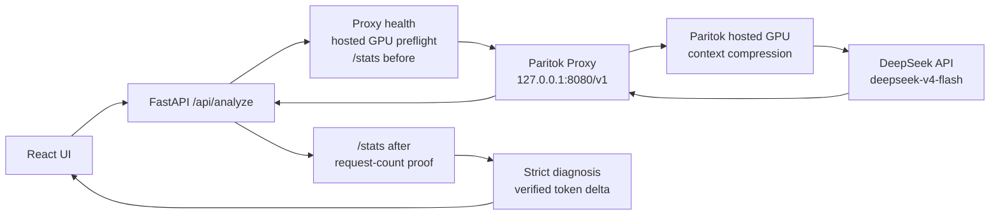
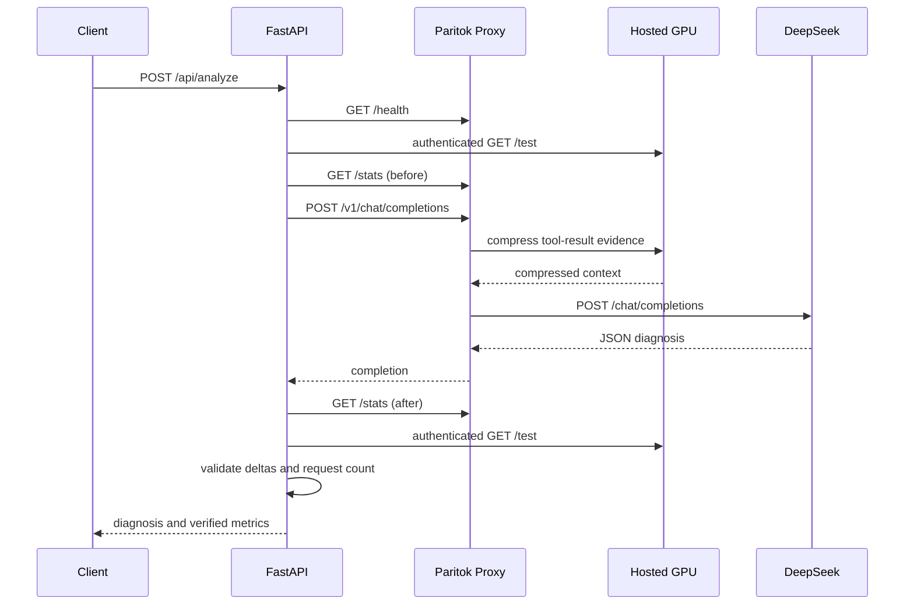

# LeanCI architecture

LeanCI is a single-user, single-worker reference implementation for token-efficient
CI failure diagnosis. Its formal analysis route is fixed:



The public `POST /api/analyze` contract cannot select a provider, model, upstream
URL, or execution mode. If the proxy, hosted GPU, or `/stats` proof is unavailable,
LeanCI fails closed and discards the model result.

## Fixed endpoints

| Purpose | Endpoint |
| --- | --- |
| OpenAI-compatible base URL used by FastAPI | `http://127.0.0.1:8080/v1` |
| Local Paritok health | `http://127.0.0.1:8080/health` |
| Local Paritok cumulative statistics | `http://127.0.0.1:8080/stats` |
| Hosted GPU preflight | `https://www.paritok.com/api/test` |
| DeepSeek upstream used by Paritok | `https://api.deepseek.com/chat/completions` |

## Components

### React

- Performs user-facing prechecks for a 2 MiB log and up to five UTF-8 text files.
- Loads five repository samples by fixed ID.
- Sends `log_text` and in-memory `files[{name, content}]` as JSON.
- Shows the diagnosis, request-scoped token proof, model, latency, and route health.
- Copies text and downloads a sanitized Markdown report.
- Never executes a patch, command, path, URL, log line, or model response.

Browser validation improves feedback only. FastAPI is the security boundary.

### FastAPI

- Enforces a 4 MiB request-body limit before JSON parsing, including chunked input.
- Revalidates log, file-count, per-file, and aggregate-file limits.
- Rejects paths, archives, executable formats, unsupported extensions, invalid
  UTF-8, NUL, and disallowed control characters.
- Uses strict Pydantic models for requests, results, and upstream statistics.
- Marks all CI evidence as untrusted data.
- Runs local health, hosted-GPU, and `/stats` checks inside the analysis lock.
- Calls the local Paritok proxy through the only formal provider.
- Validates DeepSeek JSON and permits at most one repair request.
- Returns stable public errors without secrets, upstream bodies, stack traces, or
  internal absolute paths.

### Paritok proxy

LeanCI pins `paritok[proxy]==1.2.7`. The proxy:

- listens only on `127.0.0.1:8080`;
- reads `PARITOK_API_KEY` from the process environment;
- uses `use_gpu_server: true`;
- forwards the compressed OpenAI-compatible request to DeepSeek;
- exposes local cumulative `/health` and `/stats` endpoints.

Paritok 1.2.7 may pass the original context through if the hosted compression
strategy fails. A local `health=ok` response therefore does not prove compression.
LeanCI also performs an authenticated hosted-GPU preflight before and after the
model request and verifies the `/stats` delta.

### DeepSeek

The model contract is fixed to:

- `deepseek-v4-flash`
- JSON Object output
- `max_tokens=4096`
- thinking mode disabled

`DEEPSEEK_API_KEY` is loaded from the runtime environment and is sent only through
the local proxy to the fixed upstream.

## Request sequence



Every step runs inside one `asyncio.Lock`. Uvicorn must use one worker. If another
client changes the same proxy's cumulative counters during the window,
`total_requests` no longer matches the provider attempt count; LeanCI then returns
`PARITOK_ROUTE_NOT_VERIFIED` and discards the result.

## Compressible message structure

Paritok 1.2.7 compresses historical `role=tool` results in the Chat Completions
route. LeanCI builds a protocol-valid, side-effect-free message history:

1. A fixed security system prompt.
2. A user message declaring the following content untrusted.
3. An assistant `load_ci_evidence` tool call represented only as message data.
4. One or more matching `role=tool` evidence blocks.
5. A final user request for strict JSON.

There is no server-side function registered for this tool call. Every evidence
block is wrapped in an `UNTRUSTED DATA` boundary. LeanCI cannot execute content
from the log or model.

Blocks target a conservative 12,000 UTF-8 bytes. This byte count is transport
protection only and never appears as a token metric.

## Token proof

Paritok `/stats` is validated against this strict cumulative schema:

- `total_requests`
- `input_tokens_original`
- `input_tokens_compressed`
- `compression_ratio`
- `tokens_saved`
- `tools_filtered`
- `estimated_cost_saved_usd` (accepted internally, excluded publicly)

Request-scoped values are calculated only from before/after deltas:

```text
original_tokens   = after.input_tokens_original - before.input_tokens_original
compressed_tokens = after.input_tokens_compressed - before.input_tokens_compressed
saved_tokens      = after.tokens_saved - before.tokens_saved
compression_ratio = compressed_tokens / original_tokens
proxy_requests    = after.total_requests - before.total_requests
```

The proof must satisfy:

- cumulative counters never decrease;
- all request deltas are non-negative;
- `compressed_tokens <= original_tokens`;
- `saved_tokens = original_tokens - compressed_tokens`;
- the provider is `paritok_deepseek`;
- formal provider usage is `null`;
- `proxy_requests` equals the provider's actual network attempts;
- the hosted GPU preflight succeeds before and after the request.

LeanCI never reconstructs missing Paritok metrics from character counts, DeepSeek
usage, or model output.

## Low-yield passthrough

Paritok may intentionally skip blocks below its benefit threshold. The benchmark
represents an officially traced `below_refusal_threshold` request as
`skipped_low_yield`, with `null` compression fields. It is not treated as a cache
hit, zero-percent saving, or hosted-GPU outage.

For arbitrary formal API input, LeanCI still fails closed when it cannot prove
compression. This conservative behavior prevents a passthrough result from being
presented as compressed.

## Cost estimate

Paritok's `estimated_cost_saved_usd` may use a price that does not match DeepSeek,
so it is excluded from LeanCI's public API and UI.

LeanCI calculates only:

```text
estimated_input_cost_saved_usd =
  saved_tokens * configured_cache_miss_input_price / 1,000,000
```

The current project configuration uses the DeepSeek price verified on 2026-07-31:

| Price item | USD per 1M tokens |
| --- | ---: |
| Cache-hit input | 0.0028 |
| Cache-miss input | 0.14 |
| Output | 0.28 |

This value is a configuration-based estimate, not an invoice or guaranteed saving.
Frozen benchmark and saved-sample artifacts retain their original run-time snapshot
dates.

## Timeouts and retries

| Boundary | Default timeout | Public result |
| --- | ---: | --- |
| Local proxy health | 3 seconds | 503 |
| Local proxy stats | 3 seconds | 503; no token metrics |
| Hosted GPU preflight | 10 seconds | 503 |
| DeepSeek completion | 60 seconds | 504 |
| Whole formal analysis | 110 seconds | 504; late output rejected |

Authentication and insufficient-balance errors are not retried. Connection, 429,
and 5xx handling is bounded by configuration. Empty, invalid, or schema-breaking
JSON permits exactly one repair request, through the same Paritok route.

Development can opt into invalid-response metadata. Those records contain only a
stable category, finish reason, length, and SHA-256 of the model body. They never
contain the body, user evidence, messages, usage, or credentials, and production
configuration rejects the feature.

## API surface

| Method | Path | Behavior |
| --- | --- | --- |
| `GET` | `/api/health` | Checks local proxy and hosted GPU; never calls DeepSeek |
| `GET` | `/api/config-status` | Returns booleans and fixed names, never secret values |
| `GET` | `/api/samples` | Lists fixed sample metadata |
| `GET` | `/api/samples/{id}` | Loads a fixed sample by ID |
| `GET` | `/api/captures/{id}` | Reads a saved sanitized result |
| `GET` | `/api/benchmark/results` | Reads the frozen benchmark; makes no model call |
| `POST` | `/api/analyze` | The only formal analysis route |

Sample IDs map to fixed repository directories after a resolved-root check.
Callers cannot submit filesystem paths. `ground_truth.json` is never returned to
the model.

## Benchmark isolation

`DirectDeepSeekProvider` is restricted to connection testing, troubleshooting, and
the uncompressed benchmark baseline. The formal provider factory cannot return it.

The benchmark:

- accepts only the five fixed sample IDs;
- requires `--confirm-cost`;
- runs baseline before Paritok;
- hashes identical initial messages;
- fixes the model and generation settings;
- disables network retry;
- checks that baseline leaves Paritok stats unchanged;
- records DeepSeek usage separately from Paritok proof;
- scores against deterministic ground truth;
- preserves every failed or skipped row.

See [the benchmark documentation](../benchmarks/README.md) for the frozen result and
its limitations.

## Security and deployment boundary

| Threat | Primary control |
| --- | --- |
| Credential disclosure | Environment-only secrets, ignored `.env`, redacted output, secret scanning |
| SSRF or upstream override | Code constants and strict literals; no request override |
| Paritok bypass | Formal provider factory returns Paritok only |
| Prompt injection | Untrusted tool-result boundaries and strict output schema |
| Malicious upload | Server-side size, name, extension, UTF-8, and control-character validation |
| Arbitrary file access | Fixed sample mapping; no path or URL input |
| Command execution | No execution endpoint; patches and commands are text |
| Counter contamination | One worker, one lock, strict deltas, request-count match |
| Error leakage | Stable errors and fixed-field access logs |
| Browser abuse | Exact CORS origins, no credentials, rate limits, one active analysis |

Access logs contain a generated request ID, method, fixed route label, status, and
duration only. They omit raw paths, query strings, headers, request bodies, uploads,
and model content.

The application does not persist submitted evidence, but formal content is sent to
Paritok, DeepSeek, and the hosting path. Operators must review those services'
retention policies.

The Docker image serves the compiled React app and FastAPI on the platform `PORT`.
Paritok remains loopback-only. A public deployment must sit behind an authenticated
TLS/OIDC gateway with shared distributed rate limiting and a UTC daily request
budget. See [production deployment](PRODUCTION_DEPLOYMENT.md),
[Docker](DOCKER.md), and [the threat model](THREAT_MODEL.md).
