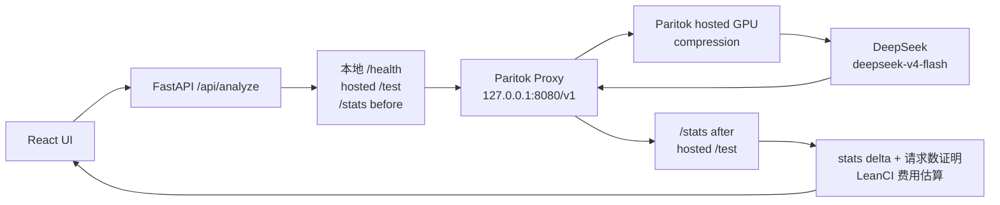
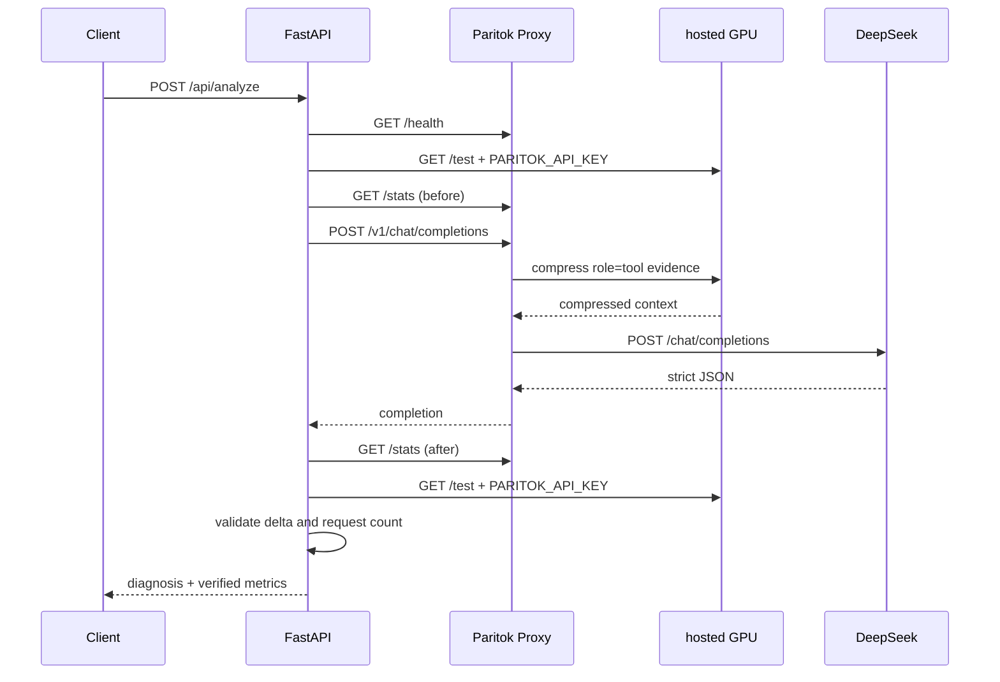

# LeanCI 架构设计

状态：阶段三正式 Paritok hosted GPU → DeepSeek 链路已实现
快照日期：2026-07-26

## 1. 正式请求路径



固定端点：

| 用途 | 地址 |
| --- | --- |
| FastAPI 的 OpenAI-compatible base URL | `http://127.0.0.1:8080/v1` |
| 本地 Proxy health | `http://127.0.0.1:8080/health` |
| 本地 Proxy stats | `http://127.0.0.1:8080/stats` |
| hosted GPU preflight | `https://www.paritok.com/api/test` |
| Paritok 的 DeepSeek 上游 | `https://api.deepseek.com/chat/completions` |

正式 `/api/analyze` 没有 Direct、Mock、模型或 URL 参数。`LLM_PROVIDER` 不是请求参数，且
正式服务只接受 `paritok`。Paritok 不可用时返回 503，不回退到 DeepSeek Direct。

## 2. 组件与职责

### React

- 本地预检 2 MiB 日志和最多 5 个 UTF-8 文本文件；
- 通过固定 ID 一次载入三个仓库内 Sample，不接受文件路径；
- 提交 JSON `log_text` 与内存中的 `files[{name, content}]`；
- 展示结构化诊断、本次 Token 指标、累计统计、模型、耗时与路由健康状态；
- 展示由 LeanCI 配置价格计算的估算值和免责声明；
- 复制 Evidence/Patch/命令并下载脱敏 Markdown 报告；
- 不执行建议命令、Diff 或模型文本。

客户端校验只用于体验，安全限制由 FastAPI 重复执行。

### FastAPI

- 在 JSON 解析前实施 4 MiB 请求体限制，包括无 `Content-Length` 的分块请求；
- 重复验证 2 MiB 日志、5 文件、单文件 256 KiB、文件合计 1 MiB；
- 清理文件名，并拒绝路径、压缩包、可执行文件、非白名单扩展名、无效文本与控制字符；
- 使用严格 Pydantic 请求、结果和上游 stats schema；
- 将 CI 证据视为不可信数据；
- 管理本地 health、hosted GPU、stats 前后快照、单实例锁和链路证明；
- 通过唯一正式 Provider 调用本地 Proxy；
- 严格验证 DeepSeek JSON，失败时最多修复一次；
- 只返回稳定公开错误，不暴露密钥、请求头、上游正文、堆栈或内部路径。

### Paritok Proxy 1.2.7

- 由 `paritok[proxy]==1.2.7` 提供；
- 只监听 `127.0.0.1:8080`；
- 从进程环境读取 `PARITOK_API_KEY`；
- 使用 `use_gpu_server: true` 和固定 hosted GPU 配置；
- 把 DeepSeek OpenAI-compatible 请求转发到完整 `/chat/completions` 端点；
- 提供 `/health` 与累计 `/stats`。

Paritok 的 hosted GPU 策略在网络、认证或 GPU 失败时可能 passthrough 原文，因此本地
`/health=ok` 不能单独证明压缩。Windows 启动脚本在监听 8080 前先执行带认证 hosted
`/test`，失败时拒绝启动；LeanCI 分析服务还会执行请求前后 hosted `/test`、stats 与
请求数校验，把 silent passthrough 变成正式接口的 fail-closed 失败。

### DeepSeek

- 模型固定 `deepseek-v4-flash`；
- JSON Object 模式；
- `max_tokens=4096`；
- `thinking={"type":"disabled"}`；
- `DEEPSEEK_API_KEY` 只来自 FastAPI 进程环境，并随本地代理请求转发。

## 3. 正式链路状态机



所有步骤位于一个 `asyncio.Lock` 内。Uvicorn 必须运行单 worker，从而避免另一个本进程
分析覆盖 before/after 窗口。若其他客户端共用同一 Proxy，`total_requests` 差值会与本次
Provider 尝试数不一致，LeanCI 返回 `PARITOK_ROUTE_NOT_VERIFIED` 并丢弃模型结果。

## 4. Paritok 可压缩消息结构

Paritok 1.2.7 的 OpenAI Chat Completions 路径压缩历史 `role=tool` 结果，而不是普通当前
user 文本。LeanCI 因此构造协议有效但无副作用的历史记录：

1. 固定 system 安全提示；
2. user 声明后续内容是不可信 CI 证据；
3. assistant 记录固定 `load_ci_evidence` tool call（仅消息结构，不会执行）；
4. 一个或多个匹配 `tool_call_id` 的 `role=tool` 文本块；
5. 最终 user 要求返回严格 JSON。

每个 tool 块带 `UNTRUSTED DATA` 边界。服务器没有对应的函数执行器，也不会运行日志、
命令、路径、URL、Diff 或验证命令。

预分块使用保守 UTF-8 字节上限，目标为 12,000 字节。2026-07-26 的真实 hosted
验证显示约 40,000 字符分块可能被 `/compress` 回显，而 12,000 字节分块可以进入压缩。
这个字节计数只用于传输保护，不作为 UI 或 API Token 指标。

## 5. stats 数据模型与链路证明

Paritok 1.2.7 `/stats` 必须通过严格 schema：

- `total_requests`
- `input_tokens_original`
- `input_tokens_compressed`
- `compression_ratio`
- `tokens_saved`
- `tools_filtered`
- `estimated_cost_saved_usd`（接收后排除，不对外展示）

单次指标只按前后快照差值计算：

```text
original_tokens   = after.input_tokens_original - before.input_tokens_original
compressed_tokens = after.input_tokens_compressed - before.input_tokens_compressed
saved_tokens      = after.tokens_saved - before.tokens_saved
compression_ratio = compressed_tokens / original_tokens
proxy_requests    = after.total_requests - before.total_requests
```

必须满足：

- 全部累计字段不倒退；
- 本次原始、压缩和节省 Token 非负；
- `compressed_tokens <= original_tokens`；
- `saved_tokens = original_tokens - compressed_tokens`；
- Provider 为 `paritok_deepseek`；
- Provider 的正式 `usage` 为 `null`；
- `proxy_requests` 等于 Provider 实际网络尝试数；
- 请求前后 hosted GPU 均通过检查。

任何 stats 超时、缺字段、无效 JSON、不一致或串扰都返回 503。LeanCI 不用字符数、
DeepSeek usage 或模型生成内容补造 Token 指标。

## 6. 费用口径

Paritok 的 `estimated_cost_saved_usd` 可能对未知模型采用默认价格，不能作为 LeanCI 的
DeepSeek 费用结果。该字段在内部 schema 中标记为排除，API、UI 和连接脚本不会返回它。

LeanCI 只计算：

```text
estimated_input_cost_saved_usd =
  saved_tokens × configured_cache_miss_input_price / 1,000,000
```

当前 DeepSeek 价格配置快照：

| 项目 | USD / 1M Token |
| --- | ---: |
| 输入 cache hit | 0.0028 |
| 输入 cache miss | 0.14 |
| 输出 | 0.28 |

快照日期 `2026-07-26`。正式压缩节省估算采用 cache-miss 输入价格，并明确标注为估算值、
不是实际账单。

## 7. 错误与超时

| 边界 | 默认超时 | 公开结果 |
| --- | ---: | --- |
| 本地 `/health` | 3 秒 | 503 |
| 本地 `/stats` | 3 秒 | 503，且不返回 Token 指标 |
| hosted GPU `/test` | 10 秒 | 503 |
| DeepSeek completion | 60 秒 | 504 |

DeepSeek 连接、429 和 5xx 采用有界重试；401/402 不重试。空内容、无效 JSON 或严格 schema
失败只允许一次修复请求。修复请求仍经过同一个 Paritok Proxy，并计入本次
`proxy_requests`。

## 8. 当前 API

### `GET /api/health`

检查 Proxy 和 hosted GPU，不调用 DeepSeek。公开字段：

- `status: ok | degraded`
- `mode: paritok`
- `paritok_connected`
- `hosted_gpu_available`
- `proxy_version`
- `model: deepseek-v4-flash`
- `deepseek_called: false`
- 安全公开消息

### `GET /api/config-status`

只返回两个 Key 是否配置、Provider 和固定模型；不返回 Key 值、长度、前后缀或 `.env`
路径。

### `POST /api/analyze`

当前请求只接受日志和内存文本文件：

```json
{
  "log_text": "CI failure text",
  "files": [
    {
      "name": "config.ts",
      "content": "export const region = process.env.DEPLOY_REGION"
    }
  ]
}
```

响应为严格诊断字段、`analysis_time_ms` 和 `compression_stats`。

### 固定 Sample 与录屏状态

- `GET /api/samples`：只返回三个固定 Sample 的元数据；
- `GET /api/samples/{id}`：从映射好的仓库目录读取日志和相关文件；
- `GET /api/captures/{id}`：读取真实三跑成功后保存的 `demo_result.json`；
- 未知 ID 返回统一 404，调用者不能提供文件系统路径。

`ground_truth.json` 只供测试和显式演示采集脚本验证，不通过 Sample API 返回，也不会进入
模型上下文。

## 9. 隔离的 Direct 与未来 benchmark

`DirectDeepSeekProvider` 只能显式用于：

- `connection_test`
- `troubleshooting`
- 未来 `benchmark_baseline`

Provider 工厂不提供 Direct 正式模式。未来 benchmark 必须：

- 只接受内置示例；
- 要求 `confirm_cost=true`；
- 顺序运行 Paritok compressed 与 `baseline_uncompressed`；
- 明确标记未压缩模式；
- 不复用 `/api/analyze` 的正式服务入口。

## 10. 安全边界

| 威胁 | 控制 |
| --- | --- |
| API Key 泄露 | SecretStr、仅环境变量、`.env` 忽略、安全脚本输出、提交前扫描 |
| SSRF/上游覆盖 | URL 为代码常量和严格 Literal，不接受请求覆盖 |
| 绕过 Paritok | 正式 Provider 工厂只返回 Paritok；失败不回退 |
| 提示注入 | 不可信 tool 结果、固定系统提示、严格结果 schema |
| 恶意上传 | 双端预检；服务端字节限制、白名单、UTF-8、控制字符和文件名/路径校验 |
| 任意文件读取 | Sample ID 到固定目录的常量映射；API 不接受路径 |
| 模型建议被执行 | 只返回文本；API 没有执行端点 |
| stats 伪造/串扰 | 单 worker、异步锁、严格快照 delta、请求数匹配 |
| 错误信息泄漏 | 稳定错误码；不返回上游正文、请求头、堆栈或内部路径 |
| 未知模型费用误导 | 丢弃 Paritok 美元字段；使用带日期的项目价格估算 |

## 11. 部署约束

Windows 本地运行使用三个终端。未来单容器部署必须：

- FastAPI 监听平台 `PORT`；
- Paritok 只监听容器 localhost `127.0.0.1:8080`；
- FastAPI 保持单 worker；
- 用固定进程管理器监管两个进程；
- 任一进程退出时终止另一个并让容器失败；
- 只公开 FastAPI 端口，不公开 8080；
- Key 只由托管平台运行时环境注入。
